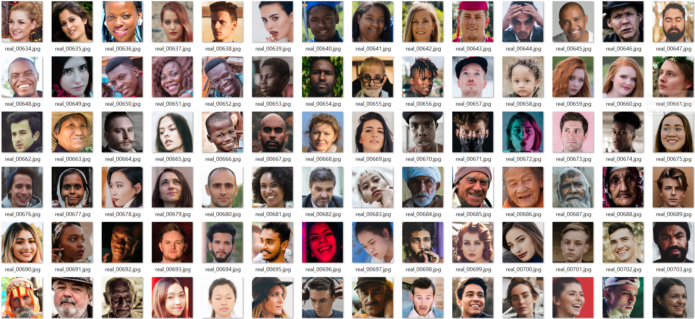
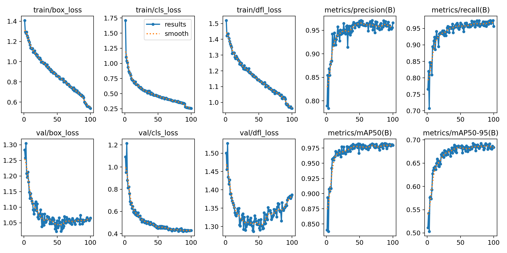

# 💤 Drowsiness Detection & Alert System Using Deep Learning

This deep learning project detects driver drowsiness in real time and helps prevent accidents by issuing audio alerts when the eyes remain closed for more than 2 seconds.

We trained a custom **YOLOv8 model** on over **7,000 images** to detect facial features like open/closed eyes and face. The system runs on webcam or uploaded media and is compatible with both local and Colab environments.

## 🔗 Live Colab Demo

> 📌 [Click here to open the project in Colab](https://colab.research.google.com/drive/1ROIP85y6HBKIRfyKd1_1W3ccDG3eC4Ps?usp=sharing)

> ⚠️ Note: Google Colab only supports uploaded images.
For real-time detection, run the code locally.


## **📹 Demo Video**

>🔊 Unmute the video if muted
https://github.com/sonir746/Drowsiness_Detection_and_Alert_System/assets/169639197/17d75760-a0d8-4437-878f-4a88cf71dbd0


## 🧪 Built With

| **Package** | **Version** |
| ----------- | ----------- |
| Python      | 3.8+        |
| OpenCV      | 4.8.1       |
| Yolo        | 8.0.2       |
| PyTorch     | 2.1.2       |
| Pyttsx3     | 2.90        |
| LabelImg    | 1.8.6       |


## 📁 Project Structure

```bash
📦 Drowsiness_Detection_and_Alert_System
├── Source/
│   ├── Models/           # Trained YOLOv8 model
│   └── Images/           # Input/Output/Training images
├── Drowsiness-Detection.ipynb  # Clean Notebook
├── requirements.txt
└── README.md

```

## 🎨 UI Snapshots

### Labeling Example


### Training Data Samples


### Training Results


### Prediction Example


## 🚀 Run Locally

### 📦 [Download Source Files (Google Drive)](https://drive.google.com/drive/folders/1tMfPCD_p2vVAQL-wzFfSUY-NJERg_ypK?usp=sharing)


```bash
  # Clone repo
git clone https://github.com/sonir746/Drowsiness_Detection_and_Alert_System.git
cd Drowsiness_Detection_and_Alert_System

# Install dependencies
pip install -r requirements.txt

```


## 👤 Author

RAHUL SONI

[](https://www.linkedin.com/in/rahul-soni-004861227)
[](https://github.com/sonir746)


## 🛠️ Feedback or Issues

Have suggestions or found a bug?

Please [open an issue here](https://github.com/sonir746/Drowsiness_Detection_and_Alert_System/issues) or contact:

📧 rahulsoni7469@gmail.com


